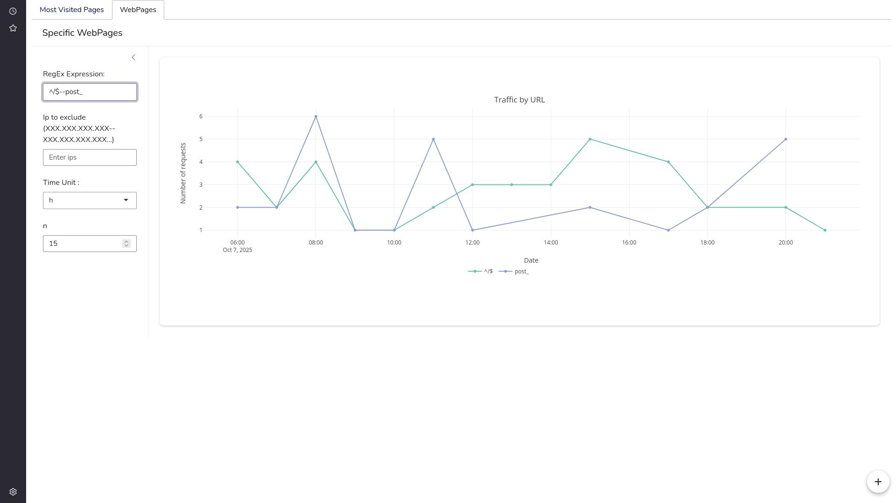

<h1>R Shiny NGINX Log Analyzer</h1>

<h2>Overview</h2>

This Shiny application provides an interactive interface for analyzing and visualizing web server access logs (e.g., NGINX logs).
It allows both file uploads and server-side log path input, performs filtering, and displays two main visualizations:
a pie chart of the most visited pages, and a time-series graph of traffic by URL.

<h2>Features</h2>
<ul>
  <li>User authentication using <code>shinymanager</code>.</li>
  <li>Log input from either a file upload or a server path.</li>
  <li>Automatic bot filtering based on known user-agent patterns.</li>
  <li>Adjustable time window using numeric and time-unit inputs.</li>
  <li>Two synchronized tabs:
    <ul>
      <li><strong>Most Visited Pages:</strong> Pie chart of top targets.</li>
      <li><strong>WebPages:</strong> Time-series of specific pages (via regex, or context is '--' between regex expression).</li>
    </ul>
  </li>
  <li>Reactive synchronization between equivalent inputs across tabs.</li>
</ul>

<h2>Project Structure</h2>
<pre>
├── global.R
├── ui.R
├── server.R
</pre>

<h2>Dependencies</h2>

The app depends on the following R packages:

<pre>
shiny
ggplot2
dplyr
lubridate
bslib
readr
bsicons
shinymanager
shinycssloaders
DT
</pre>

<h2>Authentication</h2>

User authentication is handled by <code>shinymanager</code>.  
Credentials are defined in <code>global.R</code>:

<pre>
credentials <- data.frame(
  user = c("admin"),
  password = c("adminpass"),
  admin = c(TRUE),
  stringsAsFactors = FALSE
)
</pre>

The login system is activated by wrapping:

<pre>
ui <- secure_app(ui)
res_auth <- secure_server(check_credentials = check_credentials(credentials))
</pre>

<h2>Data Processing Logic</h2>
<ol>
  <li>Reads the log file using <code>read_delim()</code> with specified column types.</li>
  <li>Filters out bot requests using a regular expression pattern (<code>bot_pat</code>).</li>
  <li>Extracts the relevant columns (<code>ip</code>, <code>date</code>, <code>target</code>).</li>
  <li>Parses the timestamp and filters to the selected time window.</li>
  <li>Normalizes the <code>target</code> field by extracting URLs between spaces.</li>
</ol>

<h2>Running the App</h2>
<ol>
  <li>Install dependencies: <code>install.packages(c("shiny","ggplot2","dplyr","lubridate","bslib","shinyWidgets","readr","bsicons","shinymanager","shinycssloaders"))</code></li>
  <li>Launch the app:
    <pre>
    library(shiny)
    shiny::runApp()
    </pre>
  </li>
  <li>Login using:
    <pre>
    user: admin
    password: adminpass
    </pre>
  </li>
</ol>

<h2>Bot filtering</h2>

Statix has strong bot filtering heuristics such: 

<ul>

<li>User Agent filtering</li>

</ul>

<pre>
<code>

ua_is_bot <- setNames(
  grepl(
    bot_regex,
    ua_unique,
    ignore.case = TRUE,
    perl = TRUE
  ),
  ua_unique
)

df <- df %>%
  filter(!ua_is_bot[ua])

</code>
</pre>

<ul>
<li>Asset heuristic</li>
</ul>

<pre>
<code>

css_clients <- df %>% 
        filter(endsWith(tolower(target), ".css")) %>%
        distinct(ip) %>%
        pull(ip)

df <- df %>% filter(ip %in% css_clients)

</code>
</pre>

<ul>
<li>Rate heuristic</li>
</ul>

<pre>
<code>

df <- df %>%
  filter(grepl("^/articles/.*\\.html$", target, ignore.case=TRUE))

df <- df %>%
  group_by(ip, sec = floor_date(date, "second")) %>%
  mutate(req_per_sec = n()) %>%
  filter(req_per_sec < 10) %>%
  ungroup() %>%
  select(-req_per_sec)

</code>
</pre>

<ul>
<li>Reading time heuristic</li>
</ul>

<pre>
<code>

df <- df %>%
  arrange(ip, date) %>%
  group_by(ip) %>%
  mutate(
    next_date = lead(date),
    time_on_page = as.numeric(difftime(next_date, date, units = "secs")),
    time_on_page = coalesce(time_on_page, -1)
  ) %>%
  ungroup() %>%
  filter(time_on_page == -1 | time_on_page > 5 & time_on_page < 3600) %>%
  select(-next_date)

</code>
</pre>

<ul>
<li>Cloud ASN repeated range burst</li>
</ul>

<pre>
<code>

df <- df %>%
  arrange(date) %>%
  mutate(
    is_cloud_asn = grepl(cloud_asn_regex, asn_org, ignore.case = TRUE),
    asn_org_clean = coalesce(asn_org, "UNKNOWN_ASN"),
    ip_16 = sub("\\.[0-9]+\\.[0-9]+$", "", ip),
    asn_changed = asn_org_clean != lag(asn_org_clean, default = first(asn_org_clean)),
    asn_bucket = cumsum(asn_changed) + 1
  ) %>%
  group_by(asn_bucket, ip_16) %>%
  mutate(ip_16_occ = n()) %>%
  ungroup() %>%
  filter(ip_16_occ == 1 | !is_cloud_asn) %>%
  select(-asn_org_clean, 
         -ip_16, -asn_changed, 
         -asn_bucket, 
         -ip_16_occ,
         -is_cloud_asn
  )

</code>
</pre>

<ul>
<li>Custom IP eclusion</li>
</ul>

<pre>
<code>

df <- df %>% filter(!grepl(ip_exclude, ip))

</code>
</pre>

<ul>
<li>Honey Pots</li>
</ul>

<pre>
<code>

good_ip <- df %>%
           filter(!(target %in% honey_pots)) %>%
           pull(ip)

df <- df %>% filter(ip %in% good_ip)

</code>
</pre>

<h2>Notes</h2>

 The accepted log format for this application is (NGINX): 

<pre>
</code>

log_format statix_tsv '$remote_addr\t'
                      '$msec\t'
                      '$uri\t'
                      '$status\t'
                      '$http_user_agent';

</code>
</pre>

