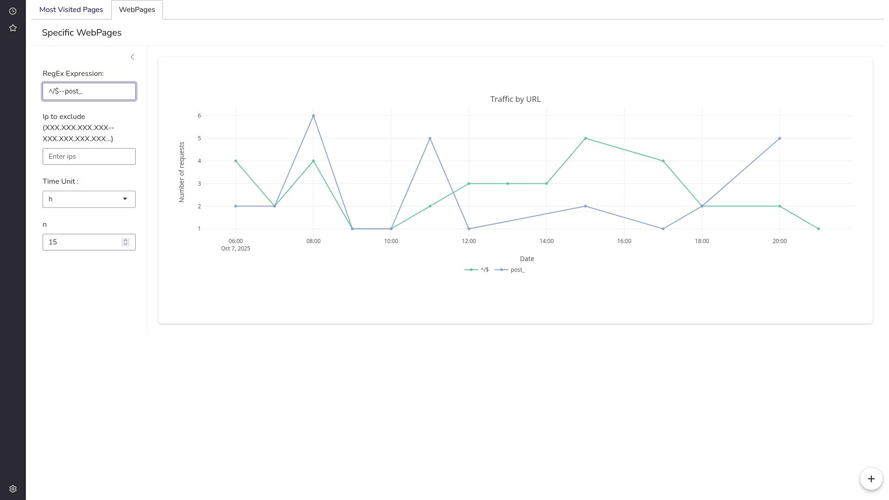

<h1>R Shiny NGINX Log Analyzer</h1>

<h2>Overview</h2>

This Shiny application provides an interactive interface for analyzing and visualizing web server access logs (e.g., NGINX logs).
It allows both file uploads and server-side log path input, performs filtering, and displays two main visualizations:
a pie chart of the most visited pages, and a time-series graph of traffic by URL.

<h2>Features</h2>
<ul>
  <li>User authentication using <code>shinymanager</code>.</li>
  <li>Log input from either a file upload or a server path.</li>
  <li>Automatic bot filtering based on known user-agent patterns.</li>
  <li>Manually exclude ips</li>
  <li>Adjustable time window using numeric and time-unit inputs.</li>
  <li>Two synchronized tabs:
    <ul>
      <li><strong>Most Visited Pages:</strong> Pie chart of top targets.</li>
      <li><strong>WebPages:</strong> Time-series of specific pages (via regex, or context is '--' between regex expression).</li>
    </ul>
  </li>
  <li>Reactive synchronization between equivalent inputs across tabs.</li>
</ul>

<h2>Project Structure</h2>
<pre>
├── global.R
├── ui.R
├── server.R
</pre>

<h2>Dependencies</h2>

The app depends on the following R packages:

<pre>
shiny
ggplot2
dplyr
lubridate
bslib
readr
bsicons
shinymanager
shinycssloaders
DT
</pre>

<h2>Authentication</h2>

User authentication is handled by <code>shinymanager</code>.  
Credentials are defined in <code>global.R</code>:

<pre>
credentials <- data.frame(
  user = c("admin"),
  password = c("adminpass"),
  admin = c(TRUE),
  stringsAsFactors = FALSE
)
</pre>

The login system is activated by wrapping:

<pre>
ui <- secure_app(ui)
res_auth <- secure_server(check_credentials = check_credentials(credentials))
</pre>

<h2>Input Synchronization</h2>

Each tab has its own <code>numericInput</code> (<code>last_n1</code>, <code>last_n2</code>)
and <code>selectInput</code> (<code>time_unit1</code>, <code>time_unit2</code>), which are kept synchronized using observers:

<pre>
observeEvent(input$last_n1, ignoreInit = TRUE, {
  updateNumericInput(session, "last_n2", value = input$last_n1)
  last_n(input$last_n1)
})
</pre>

This ensures consistent values between tabs without redundant reactivity loops.

<h2>Data Processing Logic</h2>

When a log file is uploaded or a server path is provided, the app:

<ol>
  <li>Reads the log file using <code>read_delim()</code> with specified column types.</li>
  <li>Filters out bot requests using a regular expression pattern (<code>bot_pat</code>).</li>
  <li>Extracts the relevant columns (<code>ip</code>, <code>date</code>, <code>target</code>).</li>
  <li>Parses the timestamp and filters to the selected time window.</li>
  <li>Normalizes the <code>target</code> field by extracting URLs between spaces.</li>
</ol>

<h2>Reactive Expressions</h2>

<strong>filtered_data</strong> — core reactive used by both visualizations:

<pre>
filtered_data <- reactive({
  if (!is.null(input$uploaded_file) && nrow(input$uploaded_file) > 0) {
    file_path <- input$uploaded_file$datapath
  } else if (!is.null(input$serverlogpath) && nzchar(input$serverlogpath)) {
    file_path <- input$serverlogpath
  } else {
    req(FALSE, "No file available yet.")
  }
  ...
})
</pre>

<h2>Visualizations</h2>
<ul>
  <li><strong>Pie Chart</strong>: Displays the top 5 most visited pages with percentage labels.</li>
  <li><strong>Time-Series Plot</strong>: Groups data by time unit (hour, day, week, etc.) and target group.</li>
</ul>

<h2>Key Variables</h2>
<pre>
mult_map <- c(
  h = 3600,
  d = 24 * 3600,
  w = 7 * 24 * 3600,
  m = 30 * 24 * 3600,
  y = 365 * 24 * 3600
)

interval_map <- c(
  h = "hour",
  d = "day",
  w = "week",
  m = "month",
  y = "year"
)
</pre>

<h2>Running the App</h2>
<ol>
  <li>Install dependencies: <code>install.packages(c("shiny","ggplot2","dplyr","lubridate","bslib","shinyWidgets","readr","bsicons","shinymanager","shinycssloaders"))</code></li>
  <li>Launch the app:
    <pre>
    library(shiny)
    shiny::runApp()
    </pre>
  </li>
  <li>Login using:
    <pre>
    user: admin
    password: adminpass
    </pre>
  </li>
</ol>

<h2>Notes</h2>
<ul>
  <li>The app automatically filters known bots using the <code>bot_keywords</code> list in <code>global.R</code>.</li>
  <li>Uploaded files are processed reactively and replaced when a new file is uploaded.</li>
  <li>The default time range is defined by <code>last_n()</code> × <code>mult_map[time_unit()]</code>.</li>
</ul>

<h2>Author</h2>

Developed by <strong>Julien Larget-Piet</strong>. 
All code and logic written in R Shiny.

